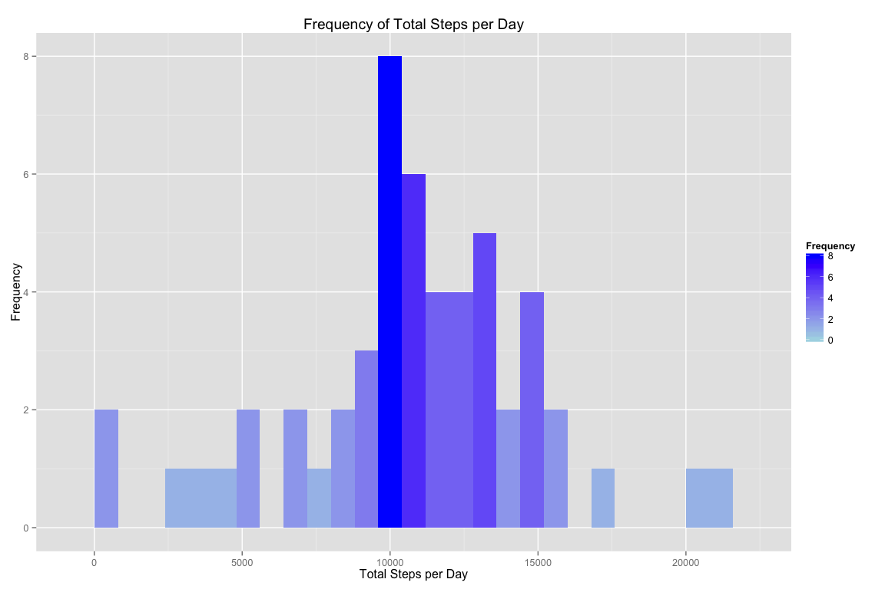
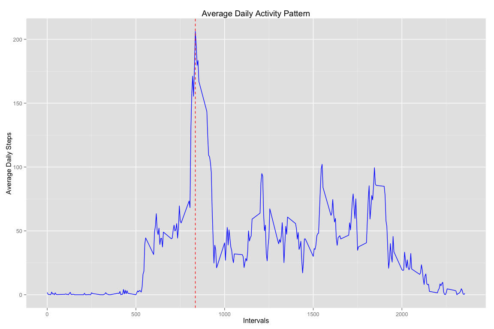
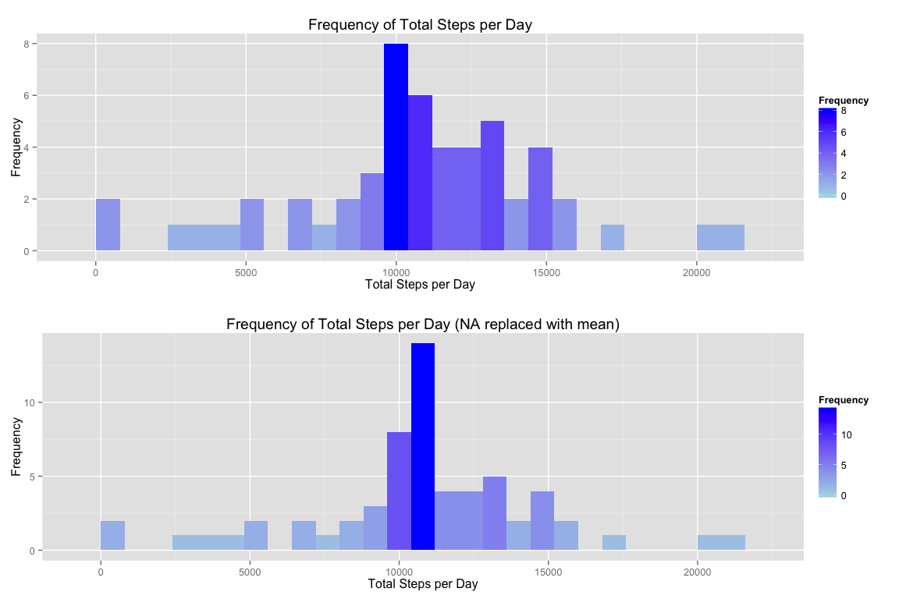
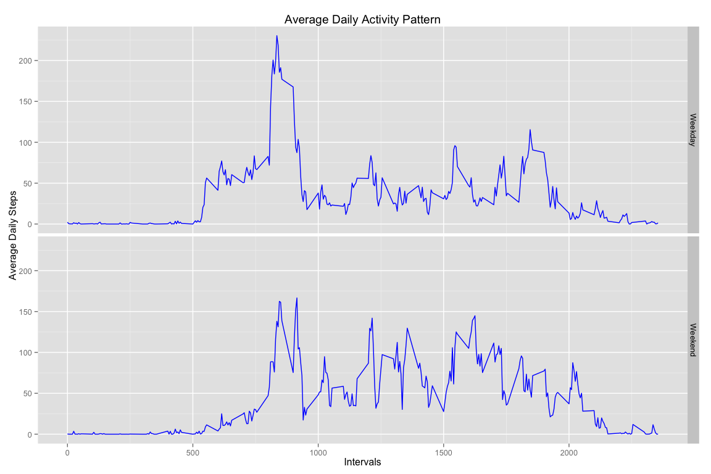

# Reproducible Research: Peer Assessment 1
Matt Narrell  
February 15, 2015  


The following libraries are used in this data analysis.

```r
library("dplyr")
library("lubridate")
library("ggplot2")
library("grid")
library("xtable")
```


## Loading and preprocessing the data
If necessary, load the CSV and transform the date variable to a POSIXct format via the [Lubridate](http://cran.r-project.org/web/packages/lubridate/index.html) package.

```r
if (!exists("act")) {
  if (!file.exists("./data/activity.csv")) {
    unzip("activity.zip", exdir = "./data")
  }
  act <- tbl_df(read.csv(file = "./data/activity.csv", stringsAsFactors = FALSE))
  act$date <- ymd(act$date)
}
```


## What is mean total number of steps taken per day?

```r
total_steps_per_day <- act %>%
  na.omit() %>%
  select(date, steps) %>%
  group_by(date) %>%
  summarize(total_steps = sum(steps))

total_steps_per_day_plot <- ggplot(total_steps_per_day, aes(x = total_steps)) +
  geom_histogram(aes(fill = ..count..), binwidth = 800) +
  scale_fill_gradient("Frequency", low = "lightblue", high = "blue") +
  xlab("Total Steps per Day") +
  ylab("Frequency") +
  ggtitle("Frequency of Total Steps per Day")

print(total_steps_per_day_plot)
```

 

```r
mean_total_steps_per_day <- mean(total_steps_per_day$total_steps)
median_total_steps_per_day <- median(total_steps_per_day$total_steps)
```
The Mean Total Steps per Day is **10766.19**
The Median Total Steps per Day is **10765**


## What is the average daily activity pattern?

```r
avg_daily_activity <- act %>%
  na.omit() %>%
  group_by(interval, date) %>%
  summarize(avg_steps = mean(steps)) %>%
  summarize(avg_steps_per_day = mean(avg_steps))

max_daily_activity <- avg_daily_activity[which.max(avg_daily_activity$avg_steps_per_day), ]

avg_daily_activity_plot <- ggplot(avg_daily_activity, aes(x = interval, y = avg_steps_per_day)) +
  geom_line(color = "blue") +
  geom_vline(color = "red", xintercept = max_daily_activity$interval, linetype = "dashed") +
  xlab("Intervals") +
  ylab("Average Daily Steps") +
  ggtitle("Average Daily Activity Pattern")

print(avg_daily_activity_plot)
```

 
The maximum number of steps is **206.1698** at the **835** interval.


## Inputing missing values

```r
fill_na_with_mean <- function(steps, intvl) {
  if (is.na(steps)) {
    (avg_daily_activity %>% filter(interval == intvl))$avg_steps_per_day
  } else {
    steps
  }
}

act_adjusted <- act %>%
  mutate(steps = mapply(fill_na_with_mean, steps, interval))

total_steps_per_day_adj <- act_adjusted %>%
  select(date, steps) %>%
  group_by(date) %>%
  summarize(total_steps = sum(steps))

total_steps_per_day_adj_plot <- ggplot(total_steps_per_day_adj, aes(x = total_steps)) +
  geom_histogram(aes(fill = ..count..), binwidth = 800) +
  scale_fill_gradient("Frequency", low = "lightblue", high = "blue") +
  xlab("Total Steps per Day") + 
  ylab("Frequency") +
  ggtitle("Frequency of Total Steps per Day (NA replaced with mean)")

mean_total_steps_per_day_adj <- mean(total_steps_per_day_adj$total_steps)
median_total_steps_per_day_adj <- median(total_steps_per_day_adj$total_steps)

mean_median_comparison <- data.frame(
  c(mean_total_steps_per_day, mean_total_steps_per_day_adj),
  c(median_total_steps_per_day, median_total_steps_per_day_adj),
  row.names = c("original", "adjusted")
)
colnames(mean_median_comparison) <- c("mean", "median")

pushViewport(viewport(layout = grid.layout(2, 1)))
print(total_steps_per_day_plot, vp = viewport(layout.pos.row = 1, layout.pos.col = 1))
print(total_steps_per_day_adj_plot, vp = viewport(layout.pos.row = 2, layout.pos.col = 1))
```

 


```r
print(xtable(mean_median_comparison), type = 'html')
```

<!-- html table generated in R 3.1.2 by xtable 1.7-4 package -->
<!-- Sun Feb 15 13:04:24 2015 -->
<table border=1>
<tr> <th>  </th> <th> mean </th> <th> median </th>  </tr>
  <tr> <td align="right"> original </td> <td align="right"> 10766.19 </td> <td align="right"> 10765.00 </td> </tr>
  <tr> <td align="right"> adjusted </td> <td align="right"> 10766.19 </td> <td align="right"> 10766.19 </td> </tr>
   </table>
Adjusting the mean and median **does not** have much impact on the estimates of the total daily number of steps


## Are there differences in activity patterns between weekdays and weekends?

```r
categorize_day <- function(date) {
  if (grepl(wday(date, label = TRUE), "Sat|Sun")) {
    "Weekend"
  } else {
    "Weekday"
  }
}

day_factored <- act_adjusted %>%
  mutate(day = factor(sapply(date, categorize_day))) %>%
  group_by(interval, day) %>%
  summarize(avg_steps = mean(steps))

day_factored_plot <- ggplot(day_factored, aes(x = interval, y = avg_steps)) +
  facet_grid(day ~ .) +
  geom_line(color = "blue") +
  xlab("Intervals") +
  ylab("Average Daily Steps") +
  ggtitle("Average Daily Activity Pattern")

print(day_factored_plot)
```

 

**Yes** there are differences in activity patterns between weekdays and weekends.  It appears that during the weekdays, the subject's activities are clustered around a shorter interval.  During the weekends, the subject's activities are more spread out and there are more instances of activity at longer intervals.
